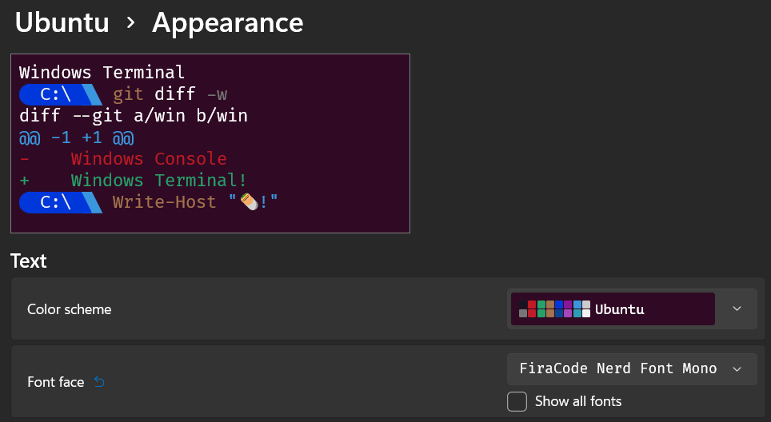
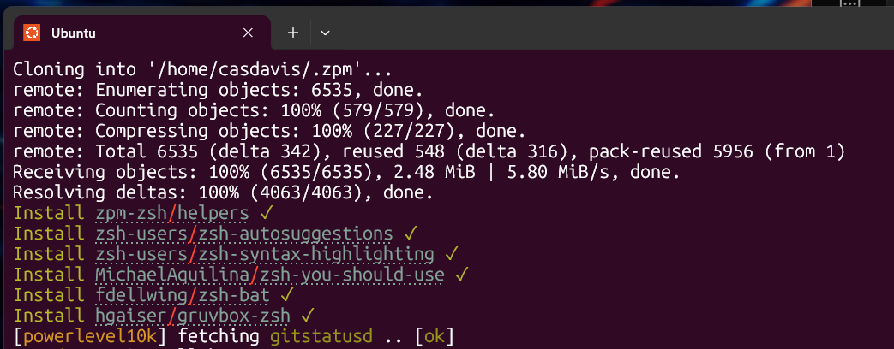

## Quick Start
Install WSL2 on your machine

```cmd
wsl --install Ubuntu
```

## Install the FiraCode Nerd Font to your Windows machine for VS Code and Windows Terminal

```powershell
choco install firacode -y
```

## Configure Windows Terminal to use the Firacode Nerd Font (important!)



You'll need to get an ssh key into your new Linux environment. This involves copying your ssh config file to ~/.ssh/ along with your SSH key. Once these are in place clone this repo:

```bash
# Clone to your home directory
git clone https://github.com/caseyjdavis/setup.git

# (Required) Set your username in playbook.yaml. While you're at it, check out the roles and vars_files too.
# (Required) Set your username, repo directory, and repos in user_environment.yml (or clone my repos, what do I care!)

# Run the bootstrap command in WSL which installs ansible and dependencies
sudo sh bootstrap.sh

# Run the ansible playbook
ansible-playbook -K playbook.yaml
```

# Close your WSL instance after the playbook successfully completes.

# Open it again and zsh plugins and powerline terminal will be configured on first login


